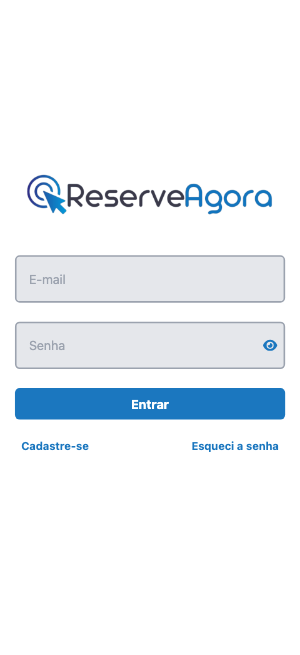
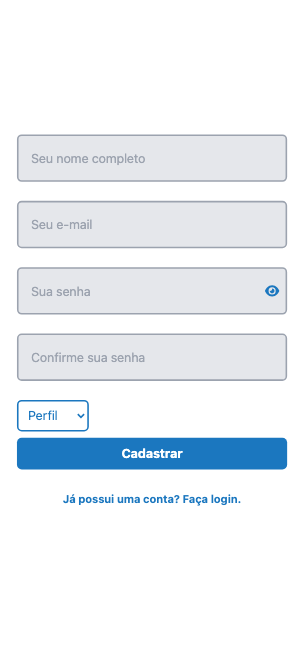
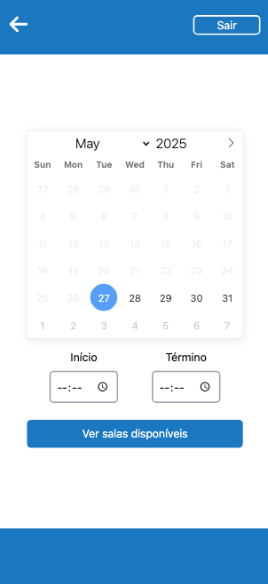
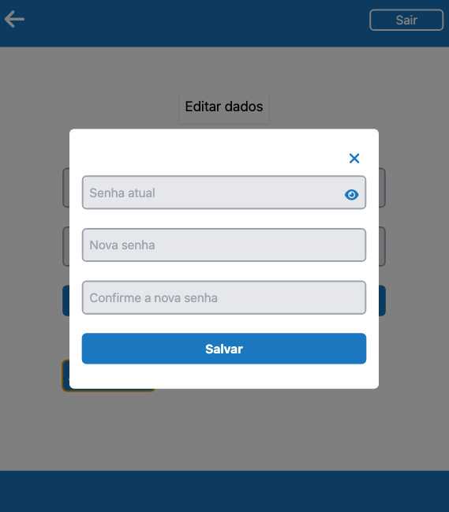
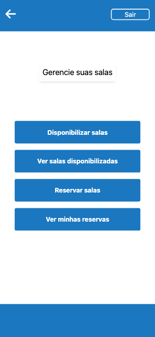

# Reserve

O Reserve trata-se do front-end de um projeto full-stack que desenvolvi. 
Foi projetado com foco em ser uma interface intuitiva, responsiva e amigável.

## Demonstração








## Tecnologias utilizadas

- ⚙️ TypeScript
- ⚙️ React
- ⚙️ Tailwind CSS

## Funcionalidades

- ✅ Layout responsivo
- ✅ Navegação por seções
- ✅ Scroll suave

## Como rodar o projeto

### Ambiente de desenvolvimento

Para iniciar o projeto em modo de desenvolvimento:

```bash
npm start
```
### Ambiente de produção

Para gerar os arquivos otimizados para produção:

```bash
...
```

Para visualizar o projeto em ambiente de produção local:

```bash
...
```

  
